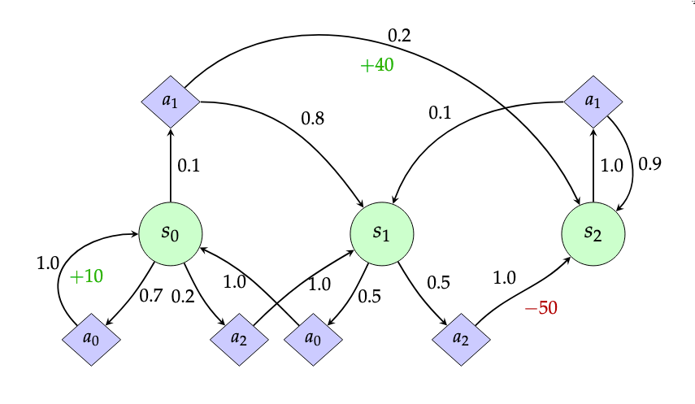

# Simulação de MDP e Aprendizado por Reforço (Q-Learning e SARSA)

Este repositório contém implementações didáticas para simular um Processo de Decisão Markoviano (MDP) e para resolver o mesmo MDP usando dois algoritmos clássicos de Aprendizado por Reforço: Q-Learning e SARSA. O objetivo é fornecer um código claro, comentado e educacional para quem está aprendendo os fundamentos de RL.

## Estrutura do Repositório

```
/SimpleQLearn
├── mdp.png                              # Diagrama do Processo de Decisão Markoviano
├── simulador_mdp.py                     # Script para simular o MDP com uma política estocástica fixa
├── q_learning.py                        # Script que implementa o algoritmo Q-Learning para encontrar a política ótima
├── sarsa.py                             # Script que implementa o algoritmo SARSA para encontrar uma política
├── requirements.txt                     # Dependências do projeto (nenhuma neste caso)
├── LICENSE                              # Licença do projeto (MIT)
└── README.md                            # Este arquivo
```

## O Processo de Decisão Markoviano (MDP)

O ambiente é composto por 3 estados (`s0`, `s1`, `s2`) e 3 ações (`a0`, `a1`, `a2`). As transições entre estados são probabilísticas e as ações geram recompensas, conforme ilustrado no diagrama abaixo e implementado nos scripts. O desafio para o agente é aprender a melhor sequência de ações para maximizar sua recompensa acumulada.



## Como Executar os Scripts

Os scripts são independentes e podem ser executados diretamente. Eles não requerem nenhuma biblioteca externa, apenas Python 3.

### 1. Simulador do MDP

Este script demonstra como o agente se comporta no ambiente seguindo uma **política estocástica pré-definida**, extraída diretamente do diagrama do MDP. É útil para entender a dinâmica do ambiente antes de aplicar qualquer aprendizado.

```bash
python3 simulador_mdp.py
```

### 2. Q-Learning

Este script implementa o algoritmo **Q-Learning (off-policy)**. O agente começa sem saber nada sobre o ambiente e, através de episódios de tentativa e erro, aprende a política ótima que maximiza a recompensa a longo prazo.

```bash
python3 q_learning.py
```

Ao final da execução, o script exibirá a Tabela Q final e a política ótima aprendida.

### 3. SARSA

Este script implementa o algoritmo **SARSA (on-policy)**. Assim como o Q-Learning, ele aprende através da interação, mas sua regra de atualização leva em conta a ação que será efetivamente tomada no próximo passo, tornando-o mais "realista" ou "conservador" em relação à política de exploração.

```bash
python3 sarsa.py
```

Ao final, ele também exibirá a Tabela Q e a política aprendida, permitindo uma comparação direta com o Q-Learning.

## Análise dos Resultados

Ao executar os scripts de aprendizado, você notará que:

1.  **Política Ótima**: Tanto o Q-Learning quanto o SARSA convergem para a mesma política ótima: `{"s0": "a1", "s1": "a0", "s2": "a1"}`. O aprendizado mais importante ocorre no estado `s1`, onde os algoritmos descobrem que devem escolher a ação `a0` para evitar a grande penalidade de -50 da ação `a2`.

2.  **Valores da Tabela Q**: Os valores Q aprendidos pelo **Q-Learning são consistentemente mais altos** (mais otimistas) do que os do SARSA. Isso ocorre porque o Q-Learning (off-policy) assume que sempre a melhor ação será tomada no futuro, enquanto o SARSA (on-policy) incorpora o custo de suas próprias ações exploratórias em seu aprendizado.

## Licença

Este projeto está licenciado sob a [Licença MIT](LICENSE).
